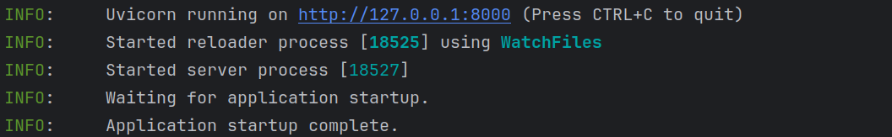
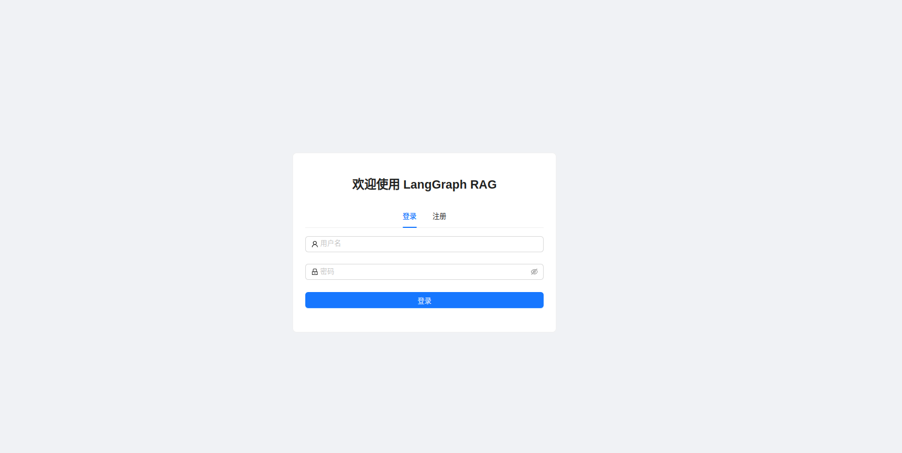
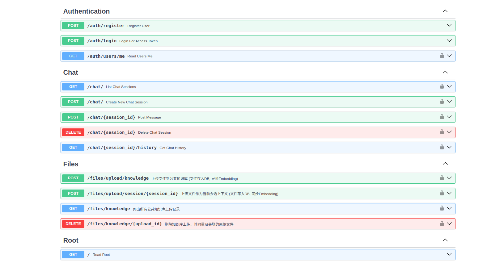

##  Quick Start

### 1. 环境准备

* 安装 Python 3.10 或更高版本。
* 推荐使用虚拟环境 (例如 `venv` 或 `conda`) 来管理项目依赖。
* 安装并运行 Ollama。请确保已下载您需要的模型 (例如 `nomic-embed-text`, `qwen3`)。您可以根据实际需求修改或下载其他模型：
    ```bash
    ollama pull nomic-embed-text
    ollama pull qwen3
    ```

### 2. 安装依赖 

* **Optional**: 推荐使用 `uv` 进行包管理，比 `pip` 更快！使用时只需要在传统pip前加上`uv`即可!
    * 安装 `uv`:
        ```bash
        pip install uv
        ```
    * 使用 `uv` 安装依赖:
        ```bash
        uv pip install -r requirements.txt
        ```
* 如果不使用 `uv`，可以直接使用 `pip`:
    ```bash
    pip install -r requirements.txt
    ```

### 3. 配置环境变量

在项目的根目录下创建一个 `.env` 文件，并填入以下内容。请确保根据您的实际情况修改占位符。

```
# .env

# JWT Configuration
JWT_SECRET_KEY="your_strong_secret_key_here"  # 必须设置一个强密钥
JWT_ALGORITHM=HS256
ACCESS_TOKEN_EXPIRE_MINUTES=30

# Ollama Configuration 
OLLAMA_BASE_URL=http://localhost:11434 # ollama运行端口改变请更改
OLLAMA_MODEL=qwen3  # 选择你的模型
OLLAMA_EMBEDING_MODEL=nomic-embed-text  # 嵌入模型


# ChromaDB Configuration
CHROMA_PERSIST_DIRECTORY=./chroma_db


# Database Configuration (SQLite)
DATABASE_URL=sqlite+aiosqlite:///./sql_app.db

CHECKPOINT_DB_URL=sqlite+aiosqlite:///./checkpoint.db

# langsmith配置
LANGSMITH_TRACING=true
LANGSMITH_ENDPOINT="https://api.smith.langchain.com"  # 这是默认端点，通常不需要更改
LANGSMITH_API_KEY="YOUR_LANGSMITH_API_KEY"    # 请设置 LangSmith API 密钥
LANGCHAIN_PROJECT="AGENT-CELL" # 可选，但推荐设置一个项目名称，方便在 LangSmith UI 中组织运行记录
```

### 3. 启动服务
请先确保位于当前项目的目录下
```bash
uvicorn api.main:app --reload
```
出现此即为成功
# 

可访问 http://127.0.0.1:8000 进行可视化操作


fastapi提供了交互式的API文档，可以访问此页面 http://127.0.0.1:8000/docs
进行交互,同样也可以采用postman,apifox等工具进行交互





## 项目开发
### 代码结构详解

以下是项目主要目录和文件的功能说明：

* **`api/`**: FastAPI 应用的核心代码。
    * `main.py`: 应用入口，包含 FastAPI 实例创建、中间件配置、生命周期事件（如数据库初始化）和根路由。
    * `routers/`: 存放按功能模块组织的 API 路由文件。
    * `schemas.py`: 定义了 Pydantic 模型，用于请求体/响应体的数据校验、序列化和文档生成。
    * `security.py`: 包含 JWT 生成与验证、密码哈希、用户身份验证等安全相关逻辑。
    * `dependencies.py`: 定义了 FastAPI 的可复用依赖项，如数据库会话获取 (`get_db_session`)。

* **`agent/`**: 智能体及其相关逻辑。
    * `cell_agent.py`: 定义了核心的 LangGraph Agent (`cell_agent`)，包括其使用的 LLM (默认为 `qwen3`)、工具集以及 Agent 的提示词（prompt）。
    * `agent_runner.py`: 负责运行 `cell_agent` 图，处理输入输出，并与 LangGraph 的检查点机制交互。
    * `graph_state.py`: 定义了 Agent 在 LangGraph 中流转的状态结构 (`AgentState`)。
    * `tools/`: 存放通用的 Agent 工具。
    * `rag/`: RAG 相关组件。
* **`database/`**: 数据库交互层。
    * `models.py`: 使用 SQLAlchemy ORM 定义数据库表结构（如 User, Session, Message, KnowledgeUpload, DocumentChunk, StoredFile）。
    * `crud.py`: (Create, Read, Update, Delete) 封装了对数据库各表的具体操作函数，供 API 层调用。
    * `database.py`: 配置数据库引擎（Engine）、异步会话创建器 (`async_session_maker`) 和数据库初始化函数 (`init_db`)。

### 开发拓展

* **添加新 Agent 工具**:
    1.  在 `agent/tools/` 目录下创建一个新的 Python 文件定义您的工具函数，并使用 `@tool` 装饰器。
    2.  在 `agent/cell_agent.py` 中，将您的新工具导入并添加到 `all_tools` 列表中。
    3.  更新 Agent 的主提示词（prompt）以告知它可以如何以及何时使用这个新工具。

* **修改 Agent 逻辑或提示词**:
    * Agent 的核心提示词（指导其如何思考和行动）位于 `agent/cell_agent.py` 中 `create_react_agent` 的 `prompt` 参数。
    * LangGraph 的图结构和节点逻辑也在 `cell_agent.py` 和 `agent_runner.py` 中定义。
